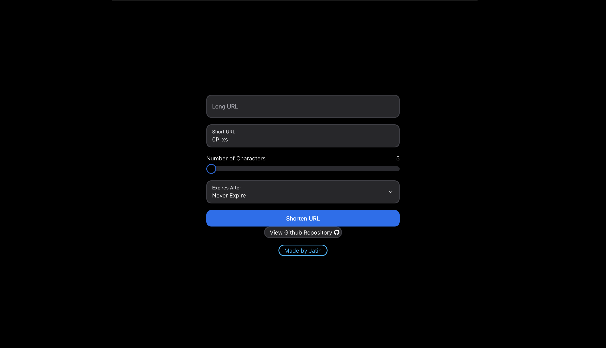

# URL Shortener

- Website that can convert any long link and generate a shorter link that redirects to it




## Features

- Dynamic shorter link Creation
- Custom short link by the user
- Auto generate randomly generated links based on a length
- Choose an expiration date for each link

## Technologies Used

- **Frontend:**

  - React.js
  - NextUI

- **Backend:**

  - Node.js
  - Express.js
  - MongoDB

- **Deploment**
  - Vercel
  - MongoDB Atlas

## Prerequisites

Before you begin, ensure you have met the following requirements:

- Node.js and npm installed on your machine.
- MongoDB installed locally or accessible through a remote server.

## Getting Started

1.  **Clone the repository:**

    ```
    git clone https://github.com/jatinkumarmajoka/URL-Shortner.git
    ```

    ```
    cd URLShortener
    ```

    <br>

2.  **Install Dependencies**

    > Tip: Create 2 Terminals for ease of use

- Install Dependencies in Backend

  ```
  cd Backend
  ```

  ```
  npm i
  ```

- Install Dependencies in Frontend

  ```
  cd Frontend/react-frontend
  ```

  ```
  npm i
  ```

    <br>

1.  **Update Environment Variables**
    - Rename '.env.template' to '.env' <br>
    - Add the link to your MongoDB connection string and your desired port.
    ```
    MONGO_DB = ""
    PORT=3000
    ```

<br>

1.  **Start Server**

    > After Navigating to _URLShortener/Backend_ using _cd Backend'_

    ```
    cd api
    ```

    ```
    node index
    ```

    <br>

    > After Navigating to _URLShortener/Frontend/react-frontend_ using _cd Frontend/react-frontend'_

    ```
    cd src
    ```

    ```
    npm start
    ```

    <br>

## Deployment

- Make sure to build the React project before deploying the Server.
  ```
    npm run build
  ```
- No need to Deploy the react frontend as the Backend will automatically serve the frontend from src/build
- Replace all hardcoded URL's from the code

### Happy coding!
